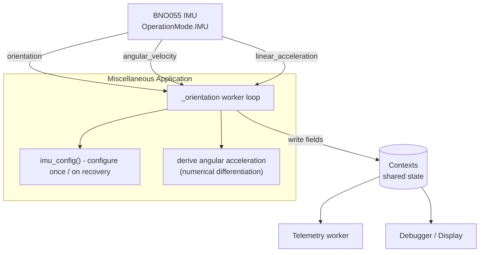

# Design Document: IMU Motion Data

## Overview

The BNO055 IMU on the vehicle currently reports only fused orientation (Euler
angles). This feature extends the existing `_orientation()` worker in
`revolution/miscellaneous.py` to additionally capture **angular velocity**
(gyroscope, dps), **linear acceleration** (gravity-removed, m/s²), and a
software-derived **angular acceleration** (dps/s).

A key technical finding drives the design: the BNO055, when running in
`OperationMode.IMU` fusion mode (its current configuration), already exposes
`angular_velocity` and `linear_acceleration` alongside `orientation`. The unit
selection already in `imu_config()` (`MS2` for acceleration, `DPS` for angular
velocity) is correct for these readings. Therefore **`imu_config()` does not
need an operation-mode change** to read the two additional sensor channels —
they are available in the current mode. The design confirms this rather than
introducing an unnecessary mode change.

Angular acceleration has **no hardware register** on the BNO055. It must be
derived in software by numerically differentiating angular velocity over time:
`angular_accel = (angular_velocity - previous_angular_velocity) / dt`, where
`dt` is the measured elapsed time between consecutive successful reads. This
requires the worker to retain the previous angular-velocity vector and a
monotonic timestamp across loop iterations, and to handle the first sample
(no previous value) gracefully.

## Architecture

The change is localized to the Miscellaneous application's orientation worker
and the shared `Contexts` data model. No new peripheries or workers are
introduced; the existing single BNO055 periphery and the existing
`_orientation_worker` are reused.



## Sequence Diagram: Orientation Worker Iteration

```mermaid
sequenceDiagram
    participant Loop as _orientation loop
    participant IMU as BNO055
    participant Clock as time.monotonic()
    participant Ctx as Contexts

    Note over Loop: previous_imu_working == True
    Loop->>IMU: read orientation
    IMU-->>Loop: Vector(x, y, z)
    Loop->>IMU: read angular_velocity
    IMU-->>Loop: Vector(x, y, z)
    Loop->>IMU: read linear_acceleration
    IMU-->>Loop: Vector(x, y, z)
    Loop->>Clock: now()
    Clock-->>Loop: t_now
    alt previous sample exists
        Loop->>Loop: dt = t_now - t_prev
        Loop->>Loop: angular_accel = (av - av_prev) / dt
    else first sample
        Loop->>Loop: angular_accel = (0, 0, 0)
    end
    Loop->>Ctx: update orientation, angular_velocity,<br/>linear_acceleration, angular_acceleration
    Loop->>Loop: store av_prev = av, t_prev = t_now
    Note over Loop,IMU: On I2CError → imu_working = False,<br/>reset previous sample, reconfigure next loop
```

## Components and Interfaces

### Component: BNO055 periphery (existing, unchanged)

**Purpose**: Hardware interface to the IMU. Already wired as
`peripheries.miscellaneous_orientation_imu_bno055`.

**Relevant read properties** (provided by `iclib.bno055.BNO055`):

```python
class BNO055:
    @property
    def orientation(self) -> Vector: ...          # Euler angles, degrees
    @property
    def angular_velocity(self) -> Vector: ...      # gyroscope, dps
    @property
    def linear_acceleration(self) -> Vector: ...   # gravity-removed, m/s^2

    @dataclass
    class Vector:
        x: float
        y: float
        z: float
```

All three are available in `OperationMode.IMU`. `Vector` is a dataclass, so
`dataclasses.asdict()` converts it to `{"x": ..., "y": ..., "z": ...}`.

### Component: Miscellaneous `_orientation()` worker (modified)

**Purpose**: Periodically read the IMU and publish motion data to `Contexts`,
including the software-derived angular acceleration.

**Responsibilities**:
- Configure the IMU once via `imu_config()` and on recovery after `I2CError`.
- Read orientation, angular velocity, and linear acceleration each iteration.
- Compute angular acceleration via numerical differentiation of angular
  velocity using measured elapsed time.
- Maintain previous-sample state (`previous_angular_velocity`,
  `previous_timestamp`) across iterations and reset it when the IMU stops
  working, so a stale `dt` is never used after a gap.
- Publish all fields and the `imu_working` flag to `Contexts`.

### Component: `imu_config()` (confirmed, no mode change)

**Purpose**: One-time configuration of the BNO055. The design explicitly keeps
the existing sequence: `reset2()` → config mode → `select_units(MS2, DPS,
DEGREES, CELSIUS)` → `OperationMode.IMU`. No additional register writes are
required because IMU fusion mode already produces all three sensor channels in
the already-selected units.

## Data Models

New fields are added to the `Contexts` dataclass in
`revolution/environment.py`, in the "Miscellaneous" section, immediately after
`miscellaneous_orientation`. They follow the existing `dict[str, float]`
pattern used by `miscellaneous_orientation` for consistency, since all three
come from the same sensor and are produced via `asdict()` on a `Vector`.

```python
# Miscellaneous (additions)

miscellaneous_orientation: dict[str, float]              # existing
miscellaneous_angular_velocity: dict[str, float]         # NEW - dps
miscellaneous_linear_acceleration: dict[str, float]      # NEW - m/s^2
miscellaneous_angular_acceleration: dict[str, float]     # NEW - dps/s (derived)
miscellaneous_orientation_imu_working: bool              # existing
```

**Validation / shape rules**:
- Each new field is a `dict[str, float]` with keys `"x"`, `"y"`, `"z"`.
- Default value is an empty dict `{}` wherever `Contexts` is constructed
  (matching the existing `miscellaneous_orientation={}` default).
- Angular acceleration is in degrees per second squared (dps/s), derived by
  differentiating the dps angular-velocity signal.

### Instantiation sites that MUST be updated

`Contexts` is constructed positionally/by keyword in multiple places. Every
site must supply defaults for the three new fields or construction will fail:

- `configurations.py` (root) — add `={}` defaults after
  `miscellaneous_orientation`.
- `revolution/tests/configurations.py` — add `={}` defaults.

### Optional telemetry exposure

`revolution/telemetry.py` defines a nested `Data` dataclass that mirrors
selected context fields. The three new fields MAY be added there to transmit
them over radio. This is optional and will be treated as a separate
consideration in requirements (it increases telemetry payload size).

## Key Functions with Formal Specifications

### Function: `_orientation()` (modified worker loop)

```python
def _orientation(self) -> None: ...
```

**Preconditions**:
- `self.environment.peripheries.miscellaneous_orientation_imu_bno055` is a
  valid BNO055 instance.
- `Contexts` contains the new motion fields.

**Postconditions**:
- On each successful iteration, `miscellaneous_orientation`,
  `miscellaneous_angular_velocity`, `miscellaneous_linear_acceleration`, and
  `miscellaneous_angular_acceleration` are updated with the latest readings.
- `miscellaneous_orientation_imu_working` reflects whether the last operation
  succeeded.
- On `I2CError`, no partial corrupt sample is published as a basis for the next
  derivative (previous-sample state is reset).

**Loop invariants**:
- When `previous_angular_velocity is not None`, `previous_timestamp` holds the
  monotonic time of the sample stored in `previous_angular_velocity`.
- After any iteration in which `imu_working` becomes `False`, both
  `previous_angular_velocity` and `previous_timestamp` are reset to `None`, so
  the next successful sample is treated as a first sample (zero acceleration).

### Function: `derive_angular_acceleration()` (new helper)

```python
def derive_angular_acceleration(
    current: dict[str, float],
    previous: dict[str, float] | None,
    dt: float,
) -> dict[str, float]: ...
```

**Preconditions**:
- `current` has keys `"x"`, `"y"`, `"z"`.
- If `previous` is not `None`, it has the same keys.
- `dt >= 0`.

**Postconditions**:
- If `previous is None` OR `dt == 0`: returns `{"x": 0.0, "y": 0.0, "z": 0.0}`
  (cannot differentiate without a valid prior sample and positive interval).
- Otherwise: returns `{k: (current[k] - previous[k]) / dt for k in axes}`.
- The input dicts are not mutated (referential transparency for inputs).

## Algorithmic Pseudocode

```pascal
ALGORITHM orientationWorkerIteration(previous_imu_working,
                                     previous_angular_velocity,
                                     previous_timestamp)
INPUT:  worker state from prior iteration
OUTPUT: updated worker state; Contexts updated as side effect

BEGIN
  IF previous_imu_working THEN
    TRY
      orientation         <- asdict(imu.orientation)
      angular_velocity    <- asdict(imu.angular_velocity)
      linear_acceleration <- asdict(imu.linear_acceleration)
      now                 <- monotonic()

      IF previous_angular_velocity = NULL THEN
        angular_acceleration <- {x:0.0, y:0.0, z:0.0}   // first sample
      ELSE
        dt <- now - previous_timestamp
        angular_acceleration <- deriveAngularAcceleration(
                                  angular_velocity,
                                  previous_angular_velocity,
                                  dt)
      END IF

      ASSERT keys(angular_acceleration) = {x, y, z}

      WITH contexts DO
        contexts.miscellaneous_orientation.update(orientation)
        contexts.miscellaneous_angular_velocity.update(angular_velocity)
        contexts.miscellaneous_linear_acceleration.update(linear_acceleration)
        contexts.miscellaneous_angular_acceleration.update(angular_acceleration)
      END WITH

      previous_angular_velocity <- angular_velocity
      previous_timestamp        <- now
      imu_working               <- TRUE
    CATCH I2CError
      imu_working               <- FALSE
      previous_angular_velocity <- NULL      // invalidate stale derivative base
      previous_timestamp        <- NULL
    END TRY
  ELSE
    TRY
      imu_config()                           // unchanged: no mode change needed
      imu_working <- TRUE
    CATCH I2CError
      imu_working <- FALSE
    END TRY
  END IF

  WITH contexts DO
    contexts.miscellaneous_orientation_imu_working <- imu_working
  END WITH

  RETURN (imu_working, previous_angular_velocity, previous_timestamp)
END
```

```pascal
ALGORITHM deriveAngularAcceleration(current, previous, dt)
INPUT:  current  : {x, y, z}
        previous : {x, y, z} OR NULL
        dt       : real >= 0
OUTPUT: {x, y, z}  (dps/s)

BEGIN
  IF previous = NULL OR dt = 0 THEN
    RETURN {x:0.0, y:0.0, z:0.0}
  END IF

  result <- {}
  FOR each axis IN {x, y, z} DO
    result[axis] <- (current[axis] - previous[axis]) / dt
  END FOR
  RETURN result
END
```

## Example Usage

```python
from dataclasses import asdict
from time import monotonic

# Inside the _orientation worker, on a working IMU:
angular_velocity = asdict(imu.angular_velocity)   # {"x": 1.2, "y": -0.4, "z": 0.0}
now = monotonic()

if previous_angular_velocity is None:
    angular_acceleration = {"x": 0.0, "y": 0.0, "z": 0.0}
else:
    dt = now - previous_timestamp                 # e.g. 0.1 s
    angular_acceleration = {
        axis: (angular_velocity[axis] - previous_angular_velocity[axis]) / dt
        for axis in ("x", "y", "z")
    }

with self.environment.contexts() as contexts:
    contexts.miscellaneous_angular_velocity.update(angular_velocity)
    contexts.miscellaneous_linear_acceleration.update(
        asdict(imu.linear_acceleration)
    )
    contexts.miscellaneous_angular_acceleration.update(angular_acceleration)

previous_angular_velocity = angular_velocity
previous_timestamp = now
```

## Correctness Properties

- **P1 (availability)**: For every successful iteration, all four motion fields
  (`orientation`, `angular_velocity`, `linear_acceleration`,
  `angular_acceleration`) are present in `Contexts` with keys `{x, y, z}`.
- **P2 (first-sample safety)**: ∀ first successful read after start or recovery,
  `angular_acceleration == {0.0, 0.0, 0.0}` (no division by a missing/zero
  baseline).
- **P3 (differentiation correctness)**: ∀ consecutive successful samples with
  `dt > 0`, for each axis
  `angular_acceleration[axis] == (av[axis] - av_prev[axis]) / dt`.
- **P4 (no stale derivative)**: After any `I2CError`, the next successful sample
  is treated as a first sample (previous state invalidated), so no derivative
  spans an IMU outage.
- **P5 (input immutability)**: `derive_angular_acceleration` does not mutate its
  `current` or `previous` arguments.
- **P6 (config invariance)**: The configuration sequence in `imu_config()` is
  unchanged; the IMU remains in `OperationMode.IMU`.

## Error Handling

### Scenario 1: I2C read failure (`I2CError`)
**Condition**: Any IMU read raises `I2CError` mid-loop.
**Response**: Set `imu_working = False`; do not publish a partial sample as a
derivative baseline; reset `previous_angular_velocity` / `previous_timestamp`.
**Recovery**: Next iteration calls `imu_config()` to reconfigure; the first
post-recovery sample yields zero angular acceleration.

### Scenario 2: Zero or non-positive `dt`
**Condition**: Two reads occur with no measurable time gap (`dt == 0`).
**Response**: Return zero angular acceleration to avoid division by zero.
**Recovery**: Subsequent iterations with positive `dt` resume normal
differentiation.

### Scenario 3: First sample after startup
**Condition**: No previous angular velocity available.
**Response**: Publish zero angular acceleration.
**Recovery**: Normal differentiation begins on the second successful sample.

## Testing Strategy

### Unit Testing
- `derive_angular_acceleration` with: first sample (`previous=None`), zero `dt`,
  normal positive `dt`, negative-delta values, and verification that inputs are
  not mutated.
- Worker iteration with a mocked BNO055 returning known `Vector`s; assert all
  four context fields are populated and `imu_working` transitions correctly.
- `I2CError` injection: assert previous-sample state is reset and a subsequent
  read produces zero acceleration.

### Property-Based Testing
**Library**: Hypothesis.
- Generate sequences of angular-velocity vectors and dt values; assert P3 holds
  for `dt > 0` and P2/P4 hold at boundaries.
- Assert P5 (immutability) over random inputs.

### Integration Testing
- Run the Miscellaneous application against the test `Peripheries` mock and
  confirm `Contexts` exposes the new fields without construction errors, given
  the updated default values in both configuration files.

## Performance Considerations

Three IMU property reads per iteration instead of one increases I2C traffic
roughly threefold per loop. The loop period is governed by
`miscellaneous_orientation_timeout` (0.1 s in test config), which provides ample
headroom. Angular-acceleration derivation is O(1) arithmetic over three axes.

## Dependencies

- `iclib.bno055.BNO055` (existing) — provides `angular_velocity` and
  `linear_acceleration` properties.
- `time.monotonic` (stdlib) — measured elapsed time for differentiation.
- `dataclasses.asdict` (stdlib, already imported) — `Vector` → dict conversion.
- No new third-party dependencies.
